### Omar benzakour
---
# Traffic sign classification

## Dataset exploration

Let us first start by some metrics :

- Number of training examples = 34799
- Number of validation examples = 4410
- Number of testing examples = 12630
- Image data shape = (32, 32, 3)
- Number of classes = 43

As we can see, our dataset contains 43 classes, let us see the distribution of the data in function of the class.
For the training dataset:

	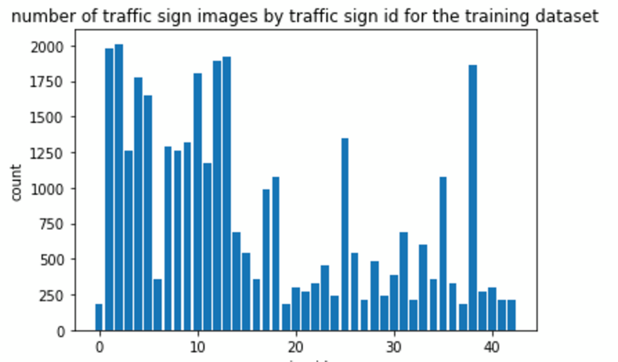

For the validation dataset:

	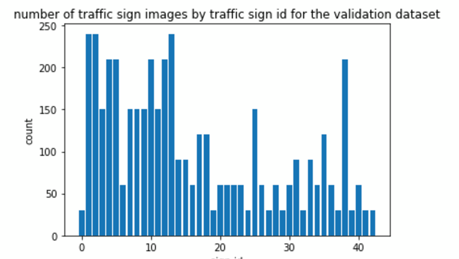

For the test dataset:

	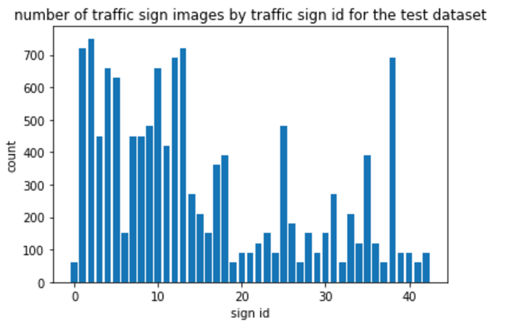

The three dataset have approximately the same distribution. Also we can see that the data is a little bit skewed since some classes are underrepresented. In case we have trouble with these classes we can augment our data small rotations and other image transformations.

## Image analysis

Let us now analyse more in depth the images. We can notice that :

- Some images are really dark and we will adjust this problem later. For example this is a dangerous curve to left sign

	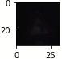

- Some traffic signs have the same shapes ( circles, triangles )
- The main colours of the traffic signs are blue, red and white
- We can split the images into “clusters”:
	- speed limit signs (id ranging from [0,8]))
	- red triangle signs (id ranging from [18, 31 ]) - turn signs (id ranging from [33, 39])
	- end of no passing (id ranging from [41,42])
	- in each of these cluster, the classes are not equally represented so we might expect confusions in these cluster

	
## Design and test of a model architecture

### Preprocessing

In order to pre-process the dataset (training, test and validation) , we apply the following transformations:

1. Since we saw that some pictures were really really dark, we first apply histogram equalization. This will allow some areas (inside of the traffic sign) to have a better contrast, thus leading to a better distinction of the traffic sign
2. The traffic sign is generally centred and contained in the 32x32 image. We can therefore crop the image in order to take out useless data (26x26) . This will also make the training faster
3. We will then sharpen the image, again, this is used to make the characteristics of the panel stand out
4. We then normalize the image to make the data have mean zero and equal variance. For image data, (pixel - 128)/ 128 is a quick way to approximately normalize the data.

result of the pre-processing (without normalization):

	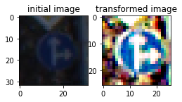

### Model architecture

The architecture of the Neural Network combines multiple stages of the classifier to bring different scales of receptive fields to the classifier. The CNN built on the top of the other CNN extracts global and invariant shapes and structure while the first one extracts local motives with more precision

**LAYER 1: (CNN)**  
Input: the image (26x26x3)  
Patch size (5x5x3) , depth 32 with a stride of 1 using a valid padding, followed by a relu subsampling : max pooling (2x2) 
Output: 22x22x32

**LAYER 2: (CNN)** 
Input : layer 1  
Patch size (5x5x32) , depth 16 with a stride of 1 using a valid padding, followed by a relu Subsampling : none  
output: 7x7x13

**LAYER 3 (CONCATENATION)** 
Concatenation of the layers 1,2

**LAYER 5 (FULLY CONNECTED)** 
Fully connected (5646) 
followed by a relu
Input : Layer 4 
Output 1200

**LAYER 6 (FULLY CONNECTED)**
Fully connected (1200) followed by a relu Input : Layer 5 with a dropout of 0.8 Output 600

**LAYER 7 (FULLY CONNECTED)**
Fully connected (120) followed by a relu Input : Layer 5 with a dropout of 0.8 Output 43

### Model training

The neural network was trained using the Adam optimizer which is better optimized than using a simple stochastic gradient ascent. I have used a batch size of 500 with a learning rate of 0.001. Decreasing the batch size or increasing the learning rate leads to an accuracy that does not steadily increase.
To prevent over fitting I have used dropouts between the fully connected networks ( rate equal to 0.8). I have also used regulation in all the layers with a coefficient equal to 0.002
I have used 60 epochs while training, there was no need to go past 60 epochs since the result was not improved afterwards. To have a better result we could have decayed the learning rate

### Solution approach

I have firstly tried to build the model without any pre-processing. Quickly I have noticed that the accuracy on the validation set didn’t get pass 93%. I have then used a confusion matrix to see where my model performs badly

	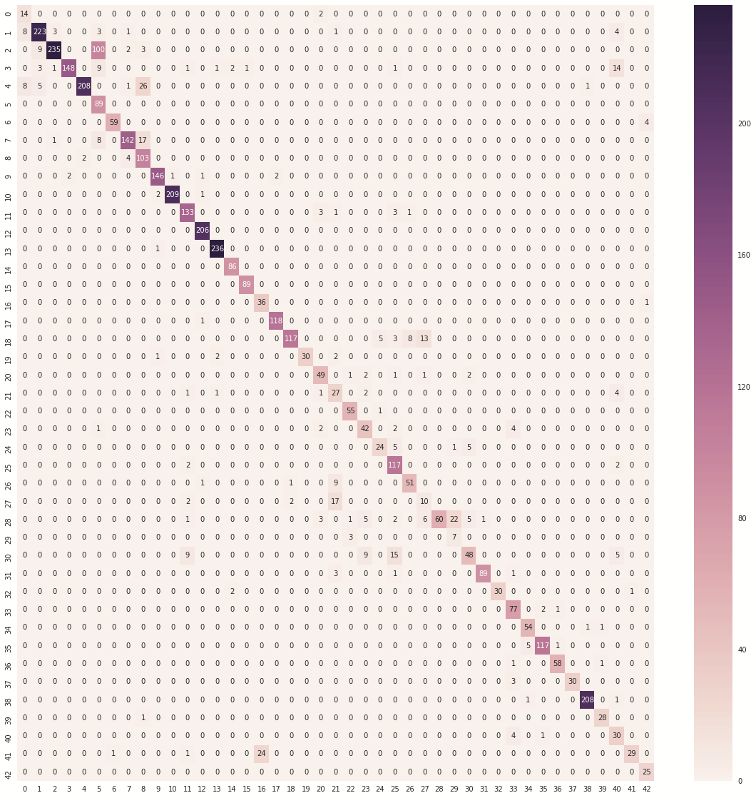

As predicted the confusion happens in the clusters that we identified in the first paragraph of this analysis.
Looking at the confusion matrix I noticed that the confusion happens sometimes for the classes which were underrepresented in the dataset. I have then decided to augement the dataset stretching the panels and rotating them.

	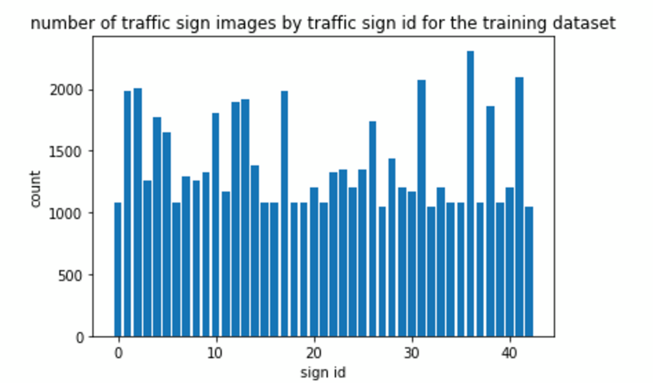

Unfortunately, this step only slowed the training and didn’t bring a real improvement. The accuracy couldn’t reach more than 94 % but the training took a lot of time because it was processing a huge amount of data
Because the training set was huge. The feedback loop (training, tuning the hyper parameters) was long and painful. I have then decided to start from scratch and “let go” the data augmentation.

Looking back at the dataset, I have seen that a lot of the images contained parasite data because the panel was centred. I have then cropped the image going from 32x32 to 26x26.

Furthermore I have decided to apply a better pre-processing (cf pre-processing paragraph). This pre-processing leads to great results ( 95% accuracy on the validation dataset, with a small training time).

Furthermore when evaluating our CNN on the test set, we notice that we reach 93,2 accuracy. The drop of accuracy between the test set and validation dataset is not that huge, meaning that our model is not really overfitting the training and validation datasets.

Looking at the confusion matrix again, we can see that our CNN is desatrous for identifying the end of no passing traffic signs (41) and mistakenly identifies them as end of all speed and passing limits. If we wanted to keep on improving the accuracy, we would have to get a closer look at this traffic class sign

	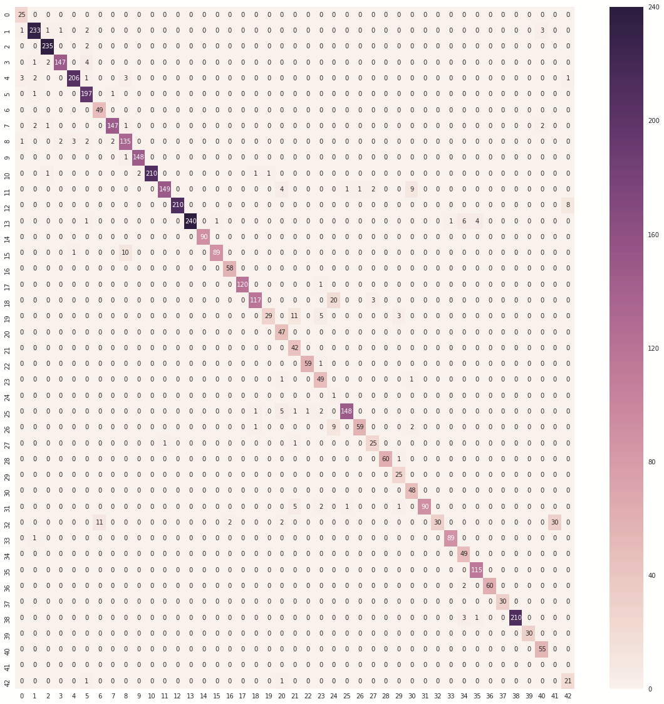

## Test of new images

In this section we add 5 news images, 4 of these images belong to the dataset and are pretty clear, they should be easily identified by our model

	
	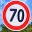
	
	

the last image doesn’t belong to the training dataset and should therefore not be identified

	

### Performance on New Images

When I first tried theses images I was surprised to see that my CNN performed badly (around 60%) accuracy. However after some investigation, I have found why.
During the preprocessing, I crope the original 32x32x3 images to 26x26x3 images. In my images I have selected only the traffic sign, so 100% of the image is usefull. When I crope the image I delete some important characteristics, the diamond shaped stop sign is no longer a diamond shape panel and the speed limit sign is not long a circle. As a consequence my CNN performs badly.
I have therefore adjusted the images to be 26x26x3 images and adapted the transform_image function not to crop the images. As a result, the accuracy of our model jumped to the expected 80% accuracy

We can observe, based on these 5 images, that the CNN has 2 behaviors. Either the CNN “is sure” of its classificiation and identifies a traffic sign with a probability superior to 0,99 or “hesitates” and has different candidates with a more or less good probability.
In the case of the “turn right” panel , our model identifies correctly the panel with a probability of 0.99

	

In the case of the traffic sign that was not on our dataset, the model wrongly identifies the panel for a speed limit sign with a huge probability. We can guess that this panel activated a lot of characteristics of the 60 km traffic sign. Indeed it has the same shape (circle) and, maybe the edge of the arrow activated a lot of characteristics of the 60 km speed sign

	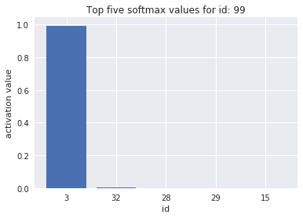

On the opposite, the 70 speed limit sign was not clearly identified by our CNN. Indeed the probability of the sign reached only 0.40 and second “contenter”’s probability was equal to 0.35 . It is kind of strange that the second candidate, a general caution sign, is not even another speed limit sign. In fact it is not even a round shaped traffic sign. From that we can maybe guess that the caracterists of a round shaped traffic sign didn’t weight that much. We should have therefore improved these features detection

	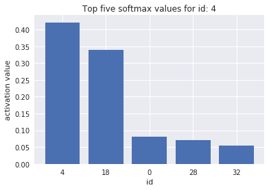

